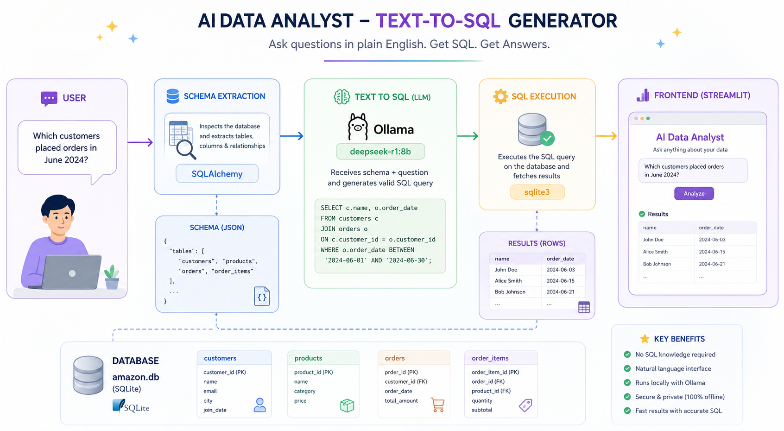

# 🤖 AI Data Analyst — Text-to-SQL Generator

A natural language interface for querying SQLite databases using a local LLM (DeepSeek R1 via Ollama). Ask questions in plain English and get results back instantly — no SQL knowledge required.



---

## ✨ Features

- **Natural Language to SQL** — Converts plain English questions into valid SQL queries
- **Schema-Aware Generation** — Automatically extracts and passes the DB schema to the LLM
- **Local LLM Powered** — Uses DeepSeek R1 (8B) via Ollama — fully offline, no API keys needed
- **Streamlit Frontend** — Clean, minimal UI for entering questions and viewing results
- **SQLite Backend** — Lightweight Amazon-style dummy database with customers, products, and orders

---

## 📁 Project Structure

```
TEXT-TO-SQL/
├── __pycache__/
├── .git/
├── .venv/
├── .gitignore
├── .python-version
├── amazon.db               # SQLite database (auto-generated)
├── create_database.py      # Script to create and seed the database
├── frontend.py             # Streamlit UI
├── main.py                 # Core logic: schema extraction, LLM call, SQL execution
├── pyproject.toml
├── requirements.txt
└── README.md
```

---

## 🗄️ Database Schema

The dummy database (`amazon.db`) mimics an e-commerce platform with 4 tables:

| Table         | Columns                                                                 |
|---------------|-------------------------------------------------------------------------|
| `customers`   | customer_id, name, email, city, join_date                               |
| `products`    | product_id, name, category, price                                       |
| `orders`      | order_id, customer_id, order_date, total_amount                         |
| `order_items` | order_item_id, order_id, product_id, quantity, subtotal                 |

---

## ⚙️ Setup & Installation

### 1. Clone the repository

```bash
git clone https://github.com/your-username/text-to-sql.git
cd text-to-sql
```

### 2. Create a virtual environment

```bash
python -m venv .venv
source .venv/bin/activate        # macOS/Linux
.venv\Scripts\activate           # Windows
```

### 3. Install dependencies

```bash
pip install -r requirements.txt
```

### 4. Install Ollama & pull the model

```bash
# Install Ollama from https://ollama.com
ollama pull deepseek-r1:8b
```

### 5. Create the database

```bash
python create_database.py
```

### 6. Run the app

```bash
streamlit run frontend.py
```

---

## 🚀 Usage

1. Open the Streamlit app in your browser (usually `http://localhost:8501`)
2. Type a natural language question in the text area
3. Click **Analyze**
4. View the results returned from the database

**Example questions:**
- *Which customers placed orders in June 2024?*
- *What is the total revenue per product category?*
- *List the top 3 customers by total spending.*
- *How many units of each product have been sold?*

---

## 📦 Requirements

> See `requirements.txt` for the full list. Key dependencies:

| Package              | Purpose                              |
|----------------------|--------------------------------------|
| `streamlit`          | Frontend UI                          |
| `langchain-core`     | Prompt templating & chaining         |
| `langchain-ollama`   | Ollama LLM integration               |
| `sqlalchemy`         | Schema inspection                    |
| `sqlite3` *(stdlib)* | Database querying                    |

---

## 🧠 How It Works

```
User Question
     │
     ▼
extract_schema()  ──►  Inspects amazon.db and returns table/column names as JSON
     │
     ▼
text_to_sql()     ──►  Sends schema + question to DeepSeek R1 via Ollama
                        LLM returns a raw SQL query string
     │
     ▼
get_data_from_database()  ──►  Executes SQL on amazon.db, returns rows
     │
     ▼
Streamlit Frontend  ──►  Displays formatted results to the user
```

---

## 🛠️ Tech Stack

- **Python 3.x**
- **Streamlit** — UI framework
- **LangChain** — LLM orchestration
- **Ollama + DeepSeek R1 (8B)** — Local LLM
- **SQLAlchemy** — DB schema inspection
- **SQLite** — Lightweight relational database

---

## 📝 Notes

- The LLM runs **entirely locally** via Ollama — no data leaves your machine.
- DeepSeek R1 uses `<think>` tags for chain-of-thought reasoning; these are stripped automatically before the SQL is executed.
- To use a different database, replace `amazon.db` and update `db_path` / `db_url` in `main.py`.

---

## 🤝 Contributing

Pull requests are welcome! For major changes, please open an issue first to discuss what you'd like to change.

---

## 📄 License

This project is open-source and available under the [MIT License](LICENSE).